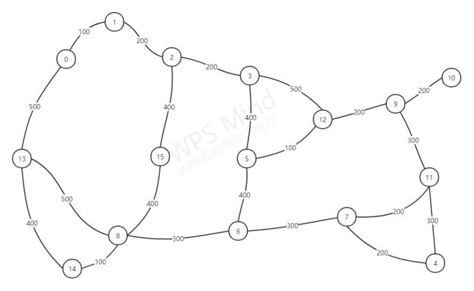

# 大学公交路线查询系统

## 问题描述

为某大学新生定制的一个线路问询交互系统，包含15个的某大学重要地点，其中需要包含校内公交站点和非公交站点，至少5条校车路线，这样可以设计出换乘路线，如果学校没有开通可以自行设计校车线路。

## 技术栈

纯c语言，无前端

学习数据结构的练手项目

## 概要设计

我选择了16个具有代表性的地点作为图的16个顶点，并让这些顶点之间拥有不同的联系；我根据自己的理解设计了5条全新的公交路线，使整个公交网络更加合理，以下为顶点和路线的设计： 

【0】京江楼教学楼 -------【1】六食堂-------------【2】E1区宿舍三叉口   

【3】新一区-----------------【4】体育馆-------------【5】西山操场三岔口

【6】三山楼-----------------【7】五棵松-------------【8】图书馆

【9】校史馆-----------------【10】教职工医院-----【11】东山操场

【12】大礼堂---------------【13】实验楼-----------【14】计算机楼

【15】C4区宿舍下台阶

初始公交路线：

一号线：1-0-13-8   六食堂-京江楼教学楼-实验楼-图书馆

二号线：1-15-8-6-7   六食堂-C4区宿舍下台阶-图书馆-三山楼-五棵松

三号线：1-3-5-6-8   六食堂-新一区-西山操场三岔口-三山楼-图书馆

四号线：3-12-11-4   新一区-大礼堂-东山操场-体育馆

五号线：10-11-7-6-8   教职工医院-东山操场-五棵松-三山楼-图书馆

## 网络图

